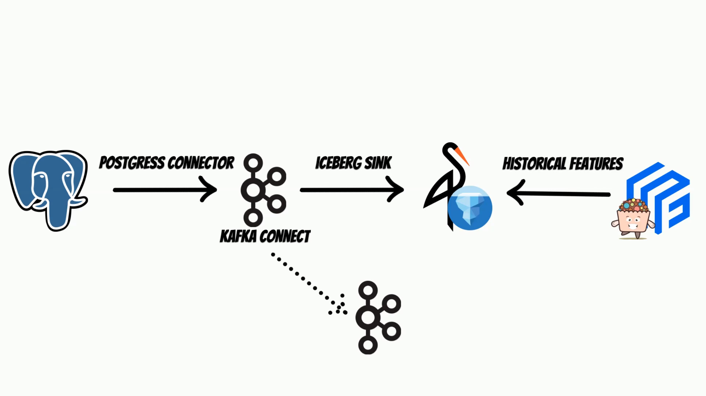

# Feature Store with Iceberg

How to use [Iceberg](https://iceberg.apache.org/) with [Feast](https://feast.dev/) feature store throught [Yummy](https://www.yummyml.com/) extension.
Additionaly how to setup end to end solution:

with:
* Postgres
* Kafka connect:
	* [postgress connector](https://debezium.io/documentation/reference/stable/connectors/postgresql.html)
	* [iceberg sink](https://github.com/getindata/kafka-connect-iceberg-sink)
* [Iceberg](https://iceberg.apache.org/) on [Minio](https://min.io/)
* [Feast](https://feast.dev/) & [Yummy](https://www.yummyml.com/)

The kafka connect inegration is based on the article: 
[https://getindata.com/blog/real-time-ingestion-iceberg-kafka-connect-apache-iceberg-sink/](https://getindata.com/blog/real-time-ingestion-iceberg-kafka-connect-apache-iceberg-sink/)

## Step 1

Watch short introduction:

## Step 2 

Go throught end to end [example notebook](https://github.com/yummyml/yummy-iceberg-kafka-connect/blob/master/notebooks/example.ipynb)

